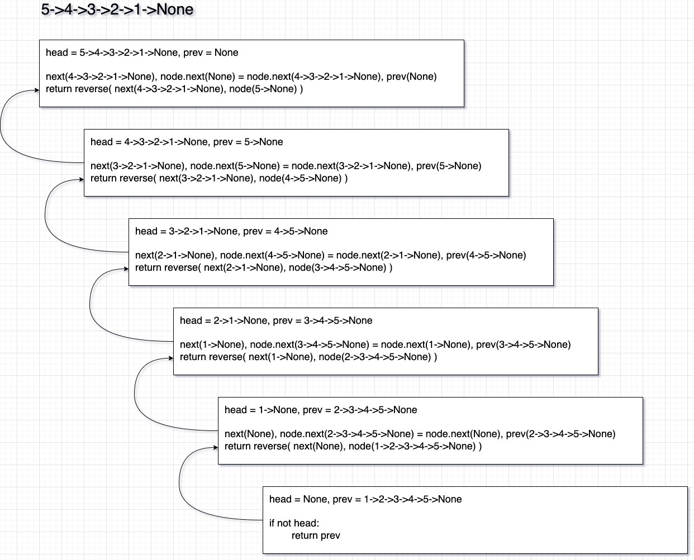

풀이 1. 재귀 구조로 뒤집기

```py
# Definition for singly-linked list.
# class ListNode:
#     def __init__(self, val=0, next=None):
#         self.val = val
#         self.next = next
class Solution:
    def reverseList(self, head: Optional[ListNode]) -> Optional[ListNode]:
        def reverse(node: Optional[ListNode], prev: Optional[ListNode] = None):
            if not node:
                return prev

            next, node.next = node.next, prev
            return reverse(next, node)

        return reverse(head)
```

node에 있는 연결 리스트의 첫 번째 노드를 prev에 할당하고

재귀 호출을 반복해서 prev에 할당한 노드를 node의 next로 할당하면서

재귀 호출을 하게 되고 입력된 연결 리스트인 node가 끝인 None이 할당된다면

prev에 할당했던 역순 연결 리스트를 return 하게 되어 마지막 재귀 함수의 return 값이 모든 재귀 호출을 return하여 최종적인 결과가 된다.



풀이 2. 반복 구조로 뒤집기

```py
# Definition for singly-linked list.
# class ListNode:
#     def __init__(self, val=0, next=None):
#         self.val = val
#         self.next = next
class Solution:
    def reverseList(self, head: Optional[ListNode]) -> Optional[ListNode]:
        node, prev = head, None
        while node:
            next, node.next = node.next, prev
            node, prev = next, node

        return prev
```

풀이 1번인 재귀를 호출하는 부분 대신 node와 prev 변수를 생성해서 재귀 함수의 인자 부분을 그대로 할당하면

node, prev는 재귀함수의 파라미터 부분이므로 같은 로직이다.

둘 다 비슷하므로 어떤 풀이를 선택하던 큰 문제는 없다. 하지만 반복 구조로 푸는 방법이 재귀 구조보다는 공간 복잡도가 더 낮은 편이다.

제출결과:

| Solution           | Runtime | Memory  |
| ------------------ | ------- | ------- |
| 재귀 구조로 뒤집기 | 32 ms   | 20.2 MB |
| 반복 구조로 뒤집기 | 28 ms   | 15.5 MB |
