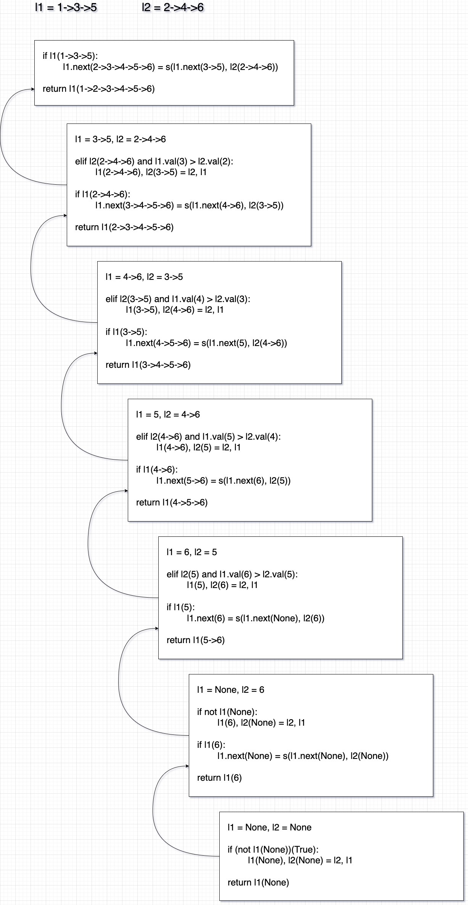

풀이 1. 재귀 구조로 연결

```py
# Definition for singly-linked list.
# class ListNode:
#     def __init__(self, val=0, next=None):
#         self.val = val
#         self.next = next
class Solution:
    def mergeTwoLists(self, list1: Optional[ListNode], list2: Optional[ListNode]) -> Optional[ListNode]:
        if (not list1) or (list2 and list1.val > list2.val):
            list1, list2 = list2, list1

        if list1:
            list1.next = self.mergeTwoLists(list1.next, list2)

        return list1
```

문제를 풀어보면서 풀이에서 이해하는데 아쉬웠던 부분들을 정리했다.

```py
if (not l1) or (l2 and l1.val > l2.val):
```

not l1은 노드가 1개일 때 재귀로 호출한다면 l1.next가 None이 되어서 True가 되어 l1과 l2를 스왑해준다.

```py
l2 and l1.val > l2.val
```

이 조건에서 l2만 있는 이유는 앞 조건의 not l1의 조건은 l1에 노드가 없는 경우 True가 되어 if문이 실행되는데

그 조건이 성립되지 않았다는것은 l1에 노드가 존재한다는 것이고 그래서 l2에 노드가 있는 경우만 체크한다.

만약 not l1의 조건이 없다면 AttributeError: 'NoneType' object has no attribute 'val' 가 발생한다.

그리고 풀이에서 나왔던 그림은 참고해봤지만 이해가 되지 않아서 직접 그려봤다.



1->3->5, 2->4->6 <br />
l1이 더 작으니 바로 l1.next(3->5)로 재귀 호출 (l = 1->) <br />

3->5, 2->4->6 <br />
l2가 더 크니 l1, l2 스왑 <br />
2->4->6, 3->5 <br />
l1.next(4->6)로 재귀 호출 (l = 2->) <br />

4->6, 3->5 <br />
l1이 더 크니 l1, l2 스왑 <br />
3->5, 4->6 <br />
l1.next(5)로 재귀 호출 (l = 3->) <br />

5, 4->6 <br />
l1이 더 크니 l1, l2 스왑 <br />
4->6, 5 <br />
l1.next(6)로 재귀 호출 (l = 4->) <br />

6, 5 <br />
l1이 더 크니 l1, l2 스왑 <br />
5, 6 <br />
l1.next(None)로 재귀 호출 (l = 5->) <br />

None, 6 <br />
l1이 None 이니 l1, l2 스왑 <br />
6, None <br />
l1.next(None)로 재귀 호출 (l = 6->) <br />

None, None <br />
l1이 None 이니 l1, n2 스왑 <br />
None, None <br />
l1(None) 리턴 <br />

리턴:

1. None
2. 6->None
3. 5->6->None
4. 4->5->6->None
5. 3->4->5->6->None
6. 2->3->4->5->6->None
7. 1->2->3->4->5->6->None

문제의 난이도는 Easy인데 풀이가 익숙하지 않은 재귀라서 이해하는데 시간이 걸린 문제였다.
