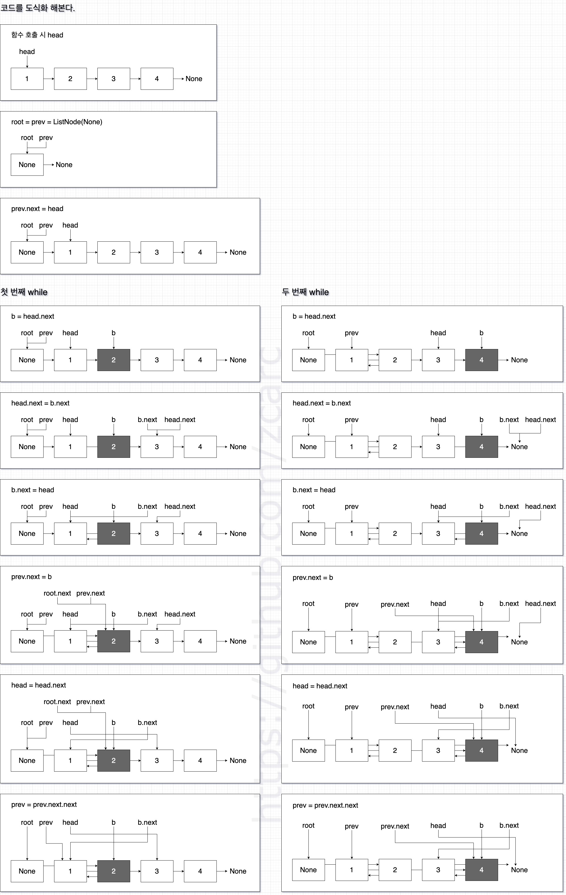
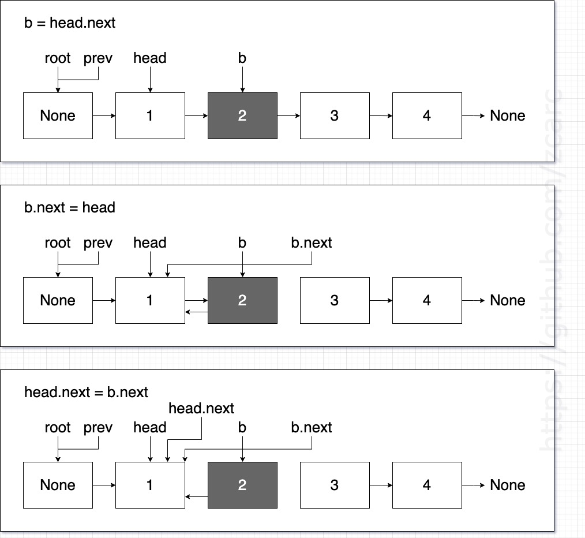
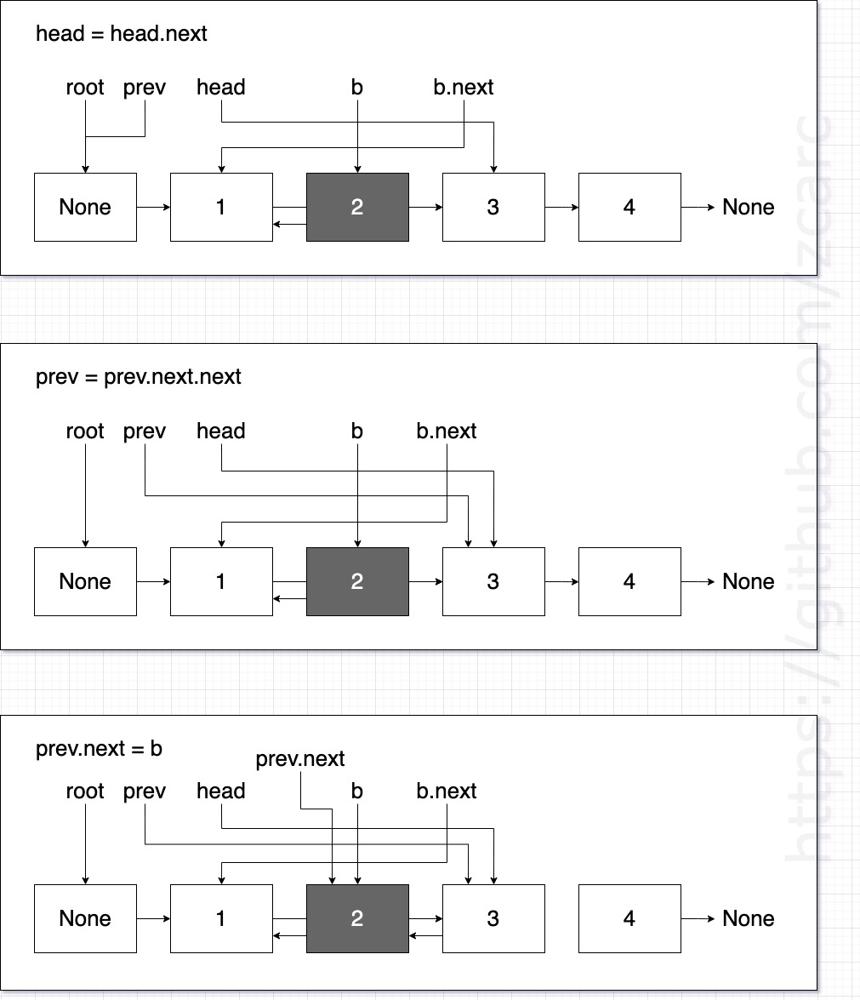
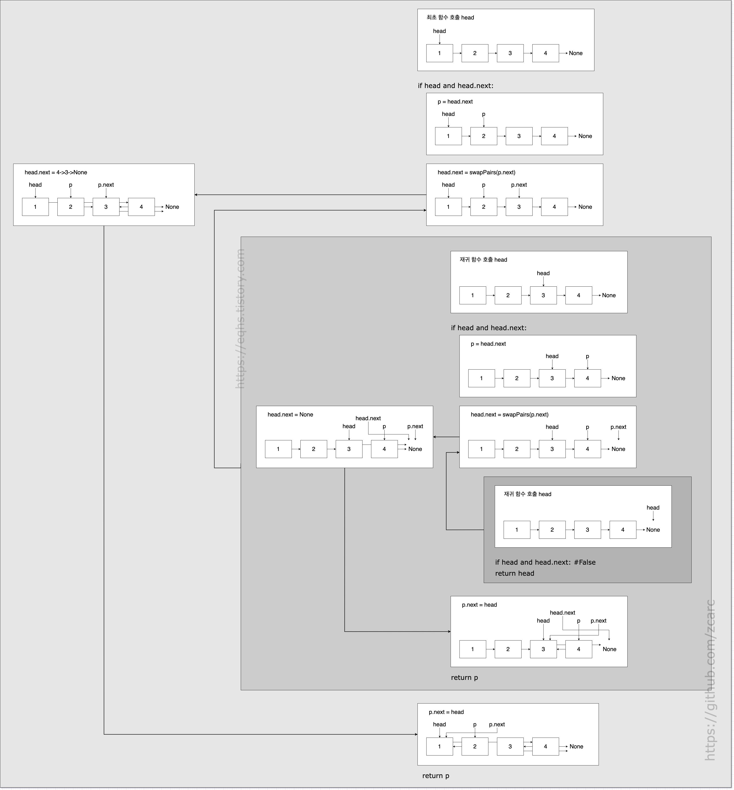

풀이 1. 값만 교환

```py
# Definition for singly-linked list.
# class ListNode:
#     def __init__(self, val=0, next=None):
#         self.val = val
#         self.next = next

class Solution:
    def swapPairs(self, head: Optional[ListNode]) -> Optional[ListNode]:
        cur = head

        while cur and cur.next:
            cur.val, cur.next.val = cur.next.val, cur.val
            cur = cur.next.next

        return head
```

연결 리스트의 노드 구조는 그대로 유지하고 값만 변경하는 방법이다. 이 방식은 실용성과는 다소 거리가 있다. 대개 연결 리스트는 복잡한 여러 가지 값들의 구조체로 구성되어 있고 값만 바꾸는 것은 매우 어려운 일이다.

이 문제는 단 하나의 값으로 구성된 연결 리스트이고, 값을 바꾸는 정도는 어렵지 않게 가능하다.

풀이 2. 반복 구조로 스왑

```py
# Definition for singly-linked list.
# class ListNode:
#     def __init__(self, val=0, next=None):
#         self.val = val
#         self.next = next

class Solution:
    def swapPairs(self, head: Optional[ListNode]) -> Optional[ListNode]:
        root = prev = ListNode(None)
        prev.next = head

        while head and head.next:
            # 두 노드( head(a), b ) 스왑
            b = head.next
            head.next = b.next
            b.next = head

            # prev 다음 b를 가리키도록 설정
            prev.next = b

            # 다음 두 노드 스왑을 위해 설정
            head = head.next
            prev = prev.next.next

        return root.next
```

그림으로 설명해본다.



첫번째 while을 마치고 <br />
prev(1->3->4->None)일 경우 <br />

prev.next = b <br />
위 코드와 같이 해주는 이유는 <br />
첫번째 while에서 prev = prev.next.next을 할당했는데 <br />
할당 하기 전 prev는 NONE->2->1->3->4->None인데 <br />
할당 후에는 prev = 1->3->4->None이 된다. <br />
이렇게 해야 다음 노드가 페어되고 나서 노드 1이 페어된 노드 3,4의 4를 가르키기 위해서인데 <br />
두번째 while에서 노드 1이 4를 가르키려면 먼저 3,4를 페어 해야하므로 <br />
head는 현재 노드 3을 가리키고 있고 b = head.next를 해준다. <br />
head(3->4->None), b(4->None) <br />

그리고 head.next = next.next를 해준다. <br />
head(3->None), b(4->None) <br />

그리고 b.next = head를 해준다. <br />
head(3->None), b(4->3->None) <br />

그 다음 여기서 현재 prev는 (1->3->4->None)인 상태니 <br />
2->1->4->3->None을 만들기 위해서 <br />

prev.next = b를 해준다. <br />
그럼 prev는 (1->4->3->None)이 된다. <br />
노드 1의 앞인 노드 2는 이미 1을 가리키고 있으므로 root가 가리키는 노드의 연결 리스트 구조는 <br />
NONE->2->1->4->3->None이 된다. <br />

그리고 앞서 할당한 prev = prev.next.next는 이처럼 페어한 노드의 첫번째 노드를 가리키기 위해서 필요하다. <br />

변수 head는 a의 역할과 같고 이 head는 반복이 끝날 때 마다 페어된 노드의 다음 첫번째 노드를 가리킨다. <br />
그리고 변수 b는 반복마다 a(head)의 next 노드가 새로 할당된다. <br />

이 과정에서 root 변수는 변경되고 있는 연결 리스트 구조의 첫번째 노드를 프로퍼티 next가 가리키고 있으므로 연결 리스트의 노드가 모두 페어 되면 연결 리스트의 첫번째 노드를 root.next가 계속 가리키고 있으므로 마지막에 최종 결과로 리턴하면 된다. <br />

맞지 않는 풀이가 되는 경우

첫 번째


반복문에서 head.next = b.next와 b.next = head의 순서를 바꾸는 경우다.
head(1->2->3->4->None), b(2->3->4->None)일 때 b.next = head를 먼저하게 되면
b.next가 head를 가리키고 head.next가 b를 가리키게 되어 여기서 노드가 순환되고
그 다음 head.next = b.next를 하면 head.next가 head 자신을 가리키게 되어 맞지 않는 풀이가 된다.

두 번째


prev.next = b가 prev = prev.next.next 다음에 위치한다면 맞지 않는 풀이가 된다. (head = head.next의 순서는 상관없다.) <br />
앞서 코드의 head.next = b.next의 결과로 prev가 (NONE->1->3->4->None)인 상태에서 <br />

b(2->1->3->4->None) 일 때, prev.next = b를 먼저하게 되면 <br />
prev는 (NONE->2->1->3->4->None)이 되고 <br />
그 다음 prev = prev.next.next를 하면 (1->3->4->None)이 돼서 정상적인 풀이가 맞는데 <br />

이 위치를 한번 바꿔보면 <br />
prev가 (NONE->1->3->4->None), b(2->1->3->4->None) 일 때, prev = prev.next.next를 먼저하게 되면 <br />
prev는 (3->4->None)이 되고 <br />
그 다음 prev.next = b를 하면 (3->2->1->3)이 되는데 여기서 이 연결 리스트는 서로 순환하는 연결 리스트가 된다. <br />
그래서 서로 계속 순환되어 끝이 없는 노드가 되어 맞지 않는 풀이가 된다. <br />

풀이 3. 재귀 구조로 스왑

```py
# Definition for singly-linked list.
# class ListNode:
#     def __init__(self, val=0, next=None):
#         self.val = val
#         self.next = next

class Solution:
    def swapPairs(self, head: Optional[ListNode]) -> Optional[ListNode]:
        if head and head.next:
            p = head.next
            # 스왑된 값 리턴 받기
            head.next = self.swapPairs(p.next)
            p.next = head
            return p

        return head
```

반복 풀이와 달리 포인터 역할을 하는 변수는 p 하나만 있어도 충분하다. 더미 노드를 만들 필요도 없이 head를 바로 리턴할 수 있어 공간 복잡도가 낮다. 재귀 호출로 계속 스왑된 값을 리턴받게 된다. 백트래킹되면서 연결 리스트가 이어지게 된다. 이러한 재귀 풀이 방식은 불필요한 변수를 사용하지 않아 공간 복잡도가 낮으면서, 빈틈 없는 코드 구조를 지니고 있어 짜임새 있다는 느낌이 든다. 다시 말해 매우 우아한 풀이라는 느낌이 든다.

다음 그림과 같이 구조를 그려봤다.


a = head, b = p 라고 가정한다. <br />
a와 b가 스왑되어야 하므로 a는 그대로두고 <br />
b를 a의 다음 노드로 할당해서 <br />
a = 1->2->3->4->None, b = 2->3->4->None인 상태로 둔다. <br />
그리고 다음 재귀 함수에서 다시 3, 4가 스왑되어야 하므로 b의 다음 노드인 b.next(3->4->None)를 인수로 넘긴다. <br />
받은 파라미터는 a(3->4->None), b(4->None)이 되고 다시 재귀 호출을 b.next(None)을 해준다. <br />
재귀 함수의 파라미터는 None이고 조건 if head 에서 False가 되어 그대로 head(None)을 리턴해준다. <br />
그러면 a.next = None가 되고 a = 3->None 이 된다. <br />
b.next = a 를 해주면 b = 4->3->None 이 되고 이걸 리턴해준다. <br />
그러면 a.next = 4->3->None 가 되고 a = 1->4->3->None 이 되고 <br />
b.next = a를 하게 되어 b = 2->1->4->3->None 을 최종적으로 리턴한다. <br />

if head and head.next에서 <br />
head.next 조건이 필요한 이유는 a(head)가 가리키는 노드가 한개 일 때 a.next가 None일 경우 b = a.next 를 할당하면 b = None 이고 여기서 재귀 호출 시 b.next를 하면 None은 next 속성이 존재하지 않으므로 AttributeError: 'NoneType' object has no attribute 'next' 에러가 발생하기 때문에 이 조건이 필요하다. <br />

재귀풀이가 간결해서 더 괜찮은 것 같다.

제출결과:

| Solution         | Runtime | Memory  |
| ---------------- | ------- | ------- |
| 값만 교환        | 41 ms   | 14.3 MB |
| 반복 구조로 스왑 | 36 ms   | 14.2 MB |
| 재귀 구조로 스왑 | 43 ms   | 14.1 MB |
