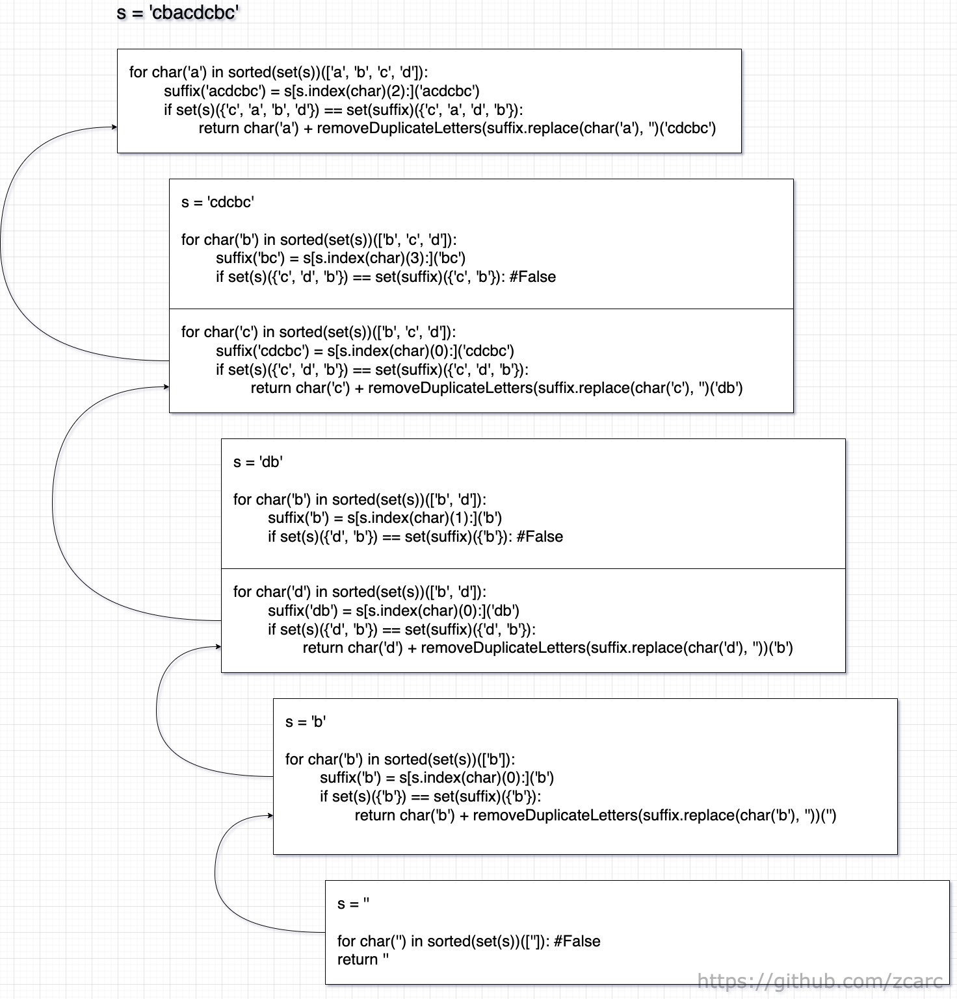
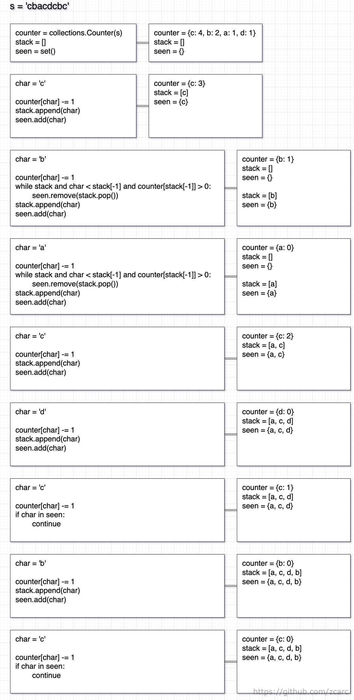
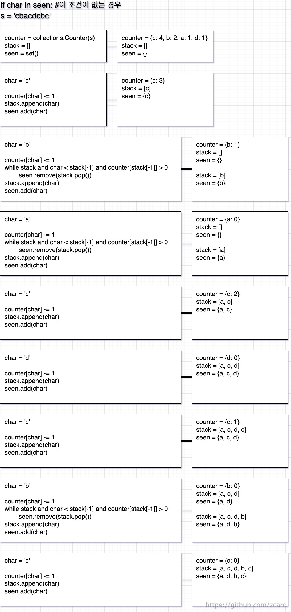
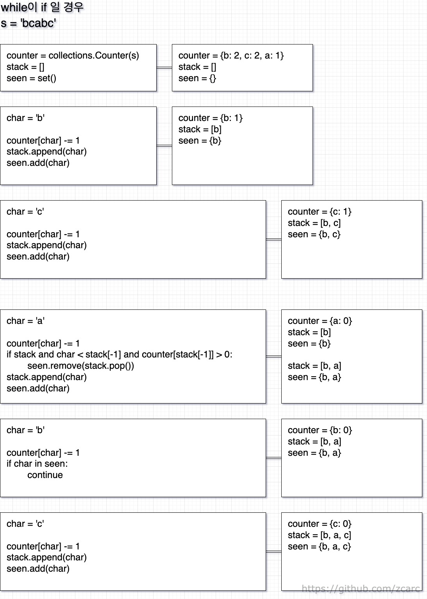

풀이 1. 재귀

```py
class Solution:
    def removeDuplicateLetters(self, s: str) -> str:
        for char in sorted(set(s)):
            suffix = s[s.index(char):]
            if set(s) == set(suffix):
                return char + self.removeDuplicateLetters(suffix.replace(char, ''))
        return ''
```

시각화



문제의 조건은 중복되는 문자를 제거하고 사전순으로 나열하라는 것인데, <br />
bcabc에서 중복 문자를 제거하고 사전에서 가장 먼저 찾을 수 있는 문자열은 abc가 된다. <br />
중복을 제거한 suffix와 s의 중복을 제거한 원소들로 비교해서 <br />
만약 같다면 <br />
해당 suffix 범위는 전체 원소 내에 포함되어 있는 원소라는 의미이다. <br />
그래서 그 suffix 내에서만 비교하면 된다. <br />
s = 'cbacdcbc' 인 경우 <br />
중복을 제외한 원소들만 가져오면 <br />
{‘a’, ‘b’, ‘c’, ‘d’} 가 있는데 이 원소들을 정렬하고 <br />
s에서 정렬 순으로 원소들을 찾아서 그 원소부터 끝까지 새로운 배열을 만들고 <br />
그 배열을 suffix라고 하면 그 suffix와 s의 중복을 제거하기 위해서 set자료형으로 변환한다. <br />
서로 중복을 제거한 집합끼리 비교를 해서 같다면 해당 suffix 범위 내에 중복을 제거한 집합 s가 포함되어 있다는 의미이다. <br />
그래서 ‘a’를 가장 앞쪽에 저장시켜준다. <br />

첫 번째 <br />
s에 있는 가장 앞쪽에 있는 ‘a’를 찾아서 문자열의 끝까지가 suffix라면 ‘acdcbc’가 되고 중복을 제거하면 {‘a’, ‘b’, ‘c’, ‘d’}가 된다. <br />
s를 중복을 제거하면 suffix와 마찬가지로 {‘a’, ‘b’, ‘c’, ‘d’}가 된다. <br />
그렇다면 여기서 모든 중복을 제거했고 집합까지 같으므로 가장 빠른 순서는 ‘a’가 된다. <br />

 <br />

두 번째 <br />
‘cdcbc’를 set으로 하면 {‘b’, ‘c’, ‘d’} ‘b’를 기준으로 suffix를 찾아서 서로 비교하면 {‘b’, ‘c’} != {‘b’, ‘c’, ‘d’} 이므로 <br />
s의 해당 위치에서부터 시작하는 suffix는 s의 집합을 포함시키지 못한다는 의미이다. <br />
이런식으로 b, c, d 이렇게 사전순으로 계속 좁혀나가면서 찾아나간다. <br />

 <br />

\*(만약 ‘cdcbcd’라면 ‘b’를 기준으로 했을 때 {‘b’, ‘c’, ‘d’}가 되므로 집합 s와 같아서 ‘b’를 ‘a’다음에 위치시킬 수 있다. 이렇게 사전순으로 정렬하면서 중복 제거를 하면 최종결과는 ‘abcd’가 된다.)

 <br />

다시 돌아와서 ‘cdcbc’인 경우에는 기준 ‘b’에서부터는 문자 ‘d’가 존재하지 않고 ‘b’의 앞쪽에만 있다는 의미이므로 ‘a’ 다음에 ‘b’를 사전순으로 좁혀나갈 수 없다. 그래서 그 다음으로 ‘c’를 기준으로 계속 좁혀나간다. 그래서 ‘a’ 다음 ‘c’가 된다.

세 번째
‘db’를 set하면 {‘b’, ‘d’}가 되는데
‘b’를 기준으로 했을 때 suffix는 {‘b’}가 되고 {‘b’, ‘d’} != {‘b’} 가 된다.

<br />

\*(만약 ‘dbd’라면 ‘b’를 기준으로 했을 때는 b, d 이렇게 사전순으로 좁혀나갈 수 있으므로 ‘c’ 다음에 ‘b’가 될 수 있다.)

<br />

다시 돌아와서
이런식으로 주어진 s의 집합을 정렬해서 사전순으로 좁혀나가는데 ‘b’ 기준 suffix는 {‘b’}이므로 중복되는 ‘d’를 찾을 수 없으니까 ‘d’ 기준 suffix를 찾아보니 {‘d’, ‘b’}가 되어 s의 집합과 같다. 그래서 ac’ 다음에 ‘d’가 더해진다.

 <br />

네 번째
‘b’를 set하면 {‘b’}가 되고 s의 집합과 같으므로 ‘acd’ 다음에 ‘b’가 더해진다.

<br />

다섯 번째
s는 ‘’ 빈 공간(Empty string)이므로 ‘’를 리턴하게 된다.

<br />

최종결과:
‘acdb’

<br />

만약 s = ‘ecbacdcbc’ 인 경우 ‘a’ 기준 suffix 범위가 s의 집합에 포함되지 않는다면
suffix 외에 있다는 것, 그 suffix 바깥에 있는 문자는 ‘a’ 기준 suffix에 중복되는 문자가 없다는 뜻이기도 하다.
그래서 사전순인 ‘a’를 기준으로 시작하기는 하되, ‘a’ 기준 suffix와 s의 집합과 같지 않을 때는 중복을 제거할 수 없으므로
‘a’를 가장 처음 위치시킬 수 없다.

<br />

풀이 2. 스택

```py
class Solution:
    def removeDuplicateLetters(self, s: str) -> str:
        counter, stack, seen = collections.Counter(s), [], set()

        for char in s:
            counter[char] -= 1

            if char in seen:
                continue

            while stack and char < stack[-1] and counter[stack[-1]] > 0:
                seen.remove(stack.pop())

            stack.append(char)
            seen.add(char)

        return ''.join(stack)
```

시각화



스택에 값을 저장하고 <br />
loop의 문자가 스택에 저장된 문자보다 더 작고(우선순위 앞서고) 카운트가 남아있다면(뒤에 문자가 있다면) <br />
스택에서 pop한다 <br />
이유는 현재 loop 문자가 더 우선순위에 앞서고 어차피 뒤에서 스택에 저장된 문자가 있기 때문이다. <br />
\*(seen은 스택에 원래 없는 검색 기능의 역할이라서 따로 다른 자료형으로 검색했고 <br />
stack을 사용해서 검색을 해도 무방하지만 원래의 스택에서는 없는 기능이라서 추가했다. <br />
그래서 이 seen의 역할은 stack or seen에 저장된 값이 이미 있다면 해당 loop의 문자는 무시하고 다음 loop를 돌아야한다. <br />
만약이 조건이 없다면 이미 스택에 저장된 문자가 loop 문자에 들어올 경우 그냥 스택에 저장하기 때문이다.) <br />
그리고 loop 문자를 stack, seen에 추가해주는데 <br />
이렇게 해주면 기존 stack, seen에 저장된 더 큰 값이 없어지고 더 작은 값이 stack, seen에 추가된다. <br />
그리고 뒤에 더 큰 중복된 값이 있을 것이므로 나중에 그 큰 값은 추가가 된다. <br />

<br />

스택에서 검색 역할까지 한다면 다음 코드도 맞는 풀이가 되기는 하지만 정석대로의 스택의 원래 역할은 아니다.

```py
class Solution:
    def removeDuplicateLetters(self, s: str) -> str:
        counter, stack = collections.Counter(s), []

        for char in s:
            counter[char] -= 1

            if char in stack:
                continue

            while stack and char < stack[-1] and counter[stack[-1]] > 0:
                stack.pop()

            stack.append(char)

        return ''.join(stack)
```

시각화





<br />

최종결과:

| Solution | Runtime | Memory  |
| -------- | ------- | ------- |
| 재귀     | 58 ms   | 14.5 MB |
| 스택     | 58 ms   | 14.3 MB |
