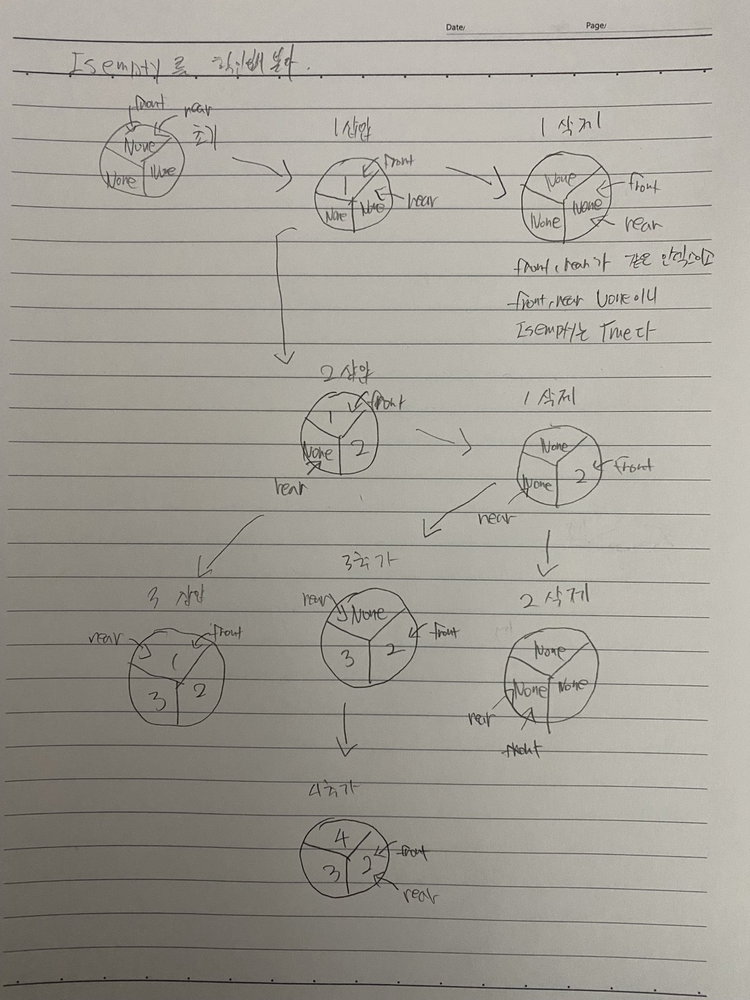

풀이 1. 배열 이용

```py
class MyCircularQueue:

    def __init__(self, k: int):
        self.q = [None] * k
        self.front = 0
        self.rear = 0
        self.maxlen = k

    def enQueue(self, value: int) -> bool:
        if self.q[self.rear] is None:
            self.q[self.rear] = value
            self.rear = (self.rear + 1) % self.maxlen
            return True
        else:
            return False

    def deQueue(self) -> bool:
        if self.q[self.front] is None:
            return False
        else:
            self.q[self.front] = None
            self.front = (self.front + 1) % self.maxlen
            return True

    def Front(self) -> int:
        return -1 if self.q[self.front] is None else self.q[self.front]

    def Rear(self) -> int:
        return -1 if self.q[self.rear - 1] is None else self.q[self.rear - 1]

    def isEmpty(self) -> bool:
        return self.front == self.rear and self.q[self.front] is None  # or, and self.q[self.rear] is None

    def isFull(self) -> bool:
        return self.front == self.rear and self.q[self.front] is not None  # or, self.q[self.rear] is not None


# Your MyCircularQueue object will be instantiated and called as such:
# obj = MyCircularQueue(k)
# param_1 = obj.enQueue(value)
# param_2 = obj.deQueue()
# param_3 = obj.Front()
# param_4 = obj.Rear()
# param_5 = obj.isEmpty()
# param_6 = obj.isFull()
```

그림



Front, Rear에서 (대문자는 메서드) <br />
front의 위치가 None일 경우와 rear-1의 위치가 None일 경우로 <br />
큐가 비어있는 지 확인할 수 있는 이유는 <br />
front의 현재 위치에 존재하는 값을 삭제하기만 하고 다음 위치로 이동하고 <br />
rear 위치에서는 현재 위치에서 새로운 값을 추가하고 다음 위치로 이동한다 <br />
<br />
front에 아무것도 없다는 것은 당연하게도 큐에 아무런 값이 없다는 것과 같다 <br />
이유는 front ~ rear로 이어지는 데 front가 없으면 rear도 없다는 의미이다. <br />
<br />
rear-1에 아무것도 없다는 것은 rear는 무조건 값을 새로 추가하면서 앞으로 이동하게 되는데 <br />
만약 최대길이가 3인 큐에 1, 2이라는 요소가 각각 있는 상태라면 front = 0, rear = 2가 되고 q[rear-1]번째에는 <br />
무조건 2라는 값이 존재해야하므로 값이 없을수가 없다. 그 전 값이 None이라면 큐는 비어있다는 의미이다. <br />
<br />
isEmpty와 isFull은 같은 위치(인덱스)일 경우, 값의 여부에 따라 풀이하였다. <br />
같은 위치일 경우는 다음과 같다.

1. 모든 요소가 None이고 front와 rear의 인덱스가 0인 초기의 상태
2. 큐에 요소가 추가된 만큼 제거된 상태
3. 큐가 꽉 찬 상태

<br />

isEmpty는 앞에서 Front, Rear가 -1을 리턴하는 경우와 똑같은 방법으로 풀 수도 있다.<br />
이 풀이는 1, 2번일 경우에 해당되므로 None일 경우 비어있는 경우다.<br />
<br />
isFull은 큐가 꽉 찬 상태이다. 1, 2번을 제외하고 값이 존재하는 경우이므로 3번이다.<br />

<br />

풀이 2.

```py
class MyCircularQueue:

    def __init__(self, k: int):
        self.q = [None] * k
        self.front = 0
        self.rear = 0
        self.maxlen = k

    def enQueue(self, value: int) -> bool:
        if self.q[self.rear] is None:
            self.q[self.rear] = value
            self.rear = (self.rear + 1) % self.maxlen
            return True
        else:
            return False

    def deQueue(self) -> bool:
        if self.q[self.front] is None:
            return False
        else:
            self.q[self.front] = None
            self.front = (self.front + 1) % self.maxlen
            return True

    def Front(self) -> int:
        return -1 if self.q[self.front] is None else self.q[self.front]

    def Rear(self) -> int:
        return -1 if self.q[self.rear - 1] is None else self.q[self.rear - 1]

    def isEmpty(self) -> bool:
        return self.q[self.front] is None

    def isFull(self) -> bool:
        return self.q[self.rear] is not None


# Your MyCircularQueue object will be instantiated and called as such:
# obj = MyCircularQueue(k)
# param_1 = obj.enQueue(value)
# param_2 = obj.deQueue()
# param_3 = obj.Front()
# param_4 = obj.Rear()
# param_5 = obj.isEmpty()
# param_6 = obj.isFull()
```

isEmpty, isFull의 구현만 다르게 해보았다. <br />
isEmpty는 front가 없으면 큐가 비어있다는 의미이고 <br />
isFull은 rear가 None이 아니라면 큐가 꽉 찬 상태라는 의미이다. <br />
