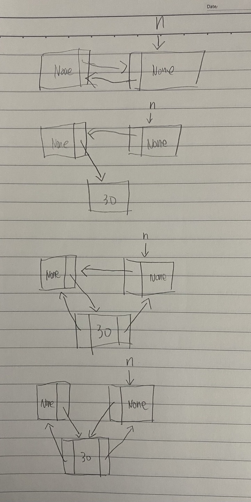
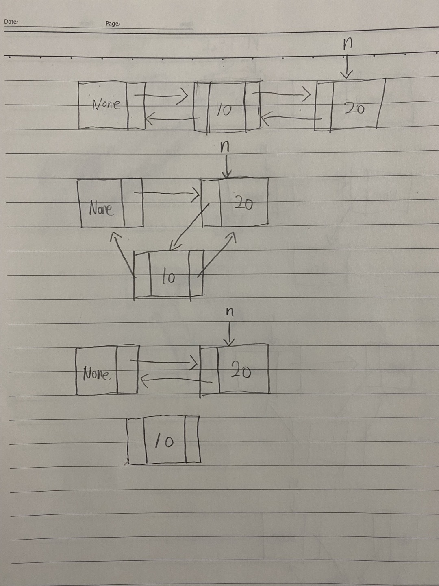

풀이 1. 이중 연결 리스트로 구현

```py
class MyCircularDeque:

    def __init__(self, k: int):
        self.head, self.tail = ListNode(None), ListNode(None)
        self.k, self.len = k, 0
        self.head.right, self.tail.left = self.tail, self.head

    def _add(self, node, new):
        n = node.right
        node.right = new
        new.left, new.right = node, n
        n.left = new

    def _del(self, node):
        n = node.right.right
        n.left = node
        node.right = n

    def insertFront(self, value: int) -> bool:
        if self.k == self.len:
            return False
        self.len += 1
        self._add(self.head, ListNode(value))
        return True

    def insertLast(self, value: int) -> bool:
        if self.k == self.len:
            return False
        self.len += 1
        self._add(self.tail.left, ListNode(value))
        return True

    def deleteFront(self) -> bool:
        if self.len == 0:
            return False
        self.len -= 1
        self._del(self.head)
        return True

    def deleteLast(self) -> bool:
        if self.len == 0:
            return False
        self.len -= 1
        self._del(self.tail.left.left)
        return True

    def getFront(self) -> int:
        return self.head.right.val if self.len else -1

    def getRear(self) -> int:
        return self.tail.left.val if self.len else -1

    def isEmpty(self) -> bool:
        return self.len == 0

    def isFull(self) -> bool:
        return self.len == self.k


# Your MyCircularDeque object will be instantiated and called as such:
# obj = MyCircularDeque(k)
# param_1 = obj.insertFront(value)
# param_2 = obj.insertLast(value)
# param_3 = obj.deleteFront()
# param_4 = obj.deleteLast()
# param_5 = obj.getFront()
# param_6 = obj.getRear()
# param_7 = obj.isEmpty()
# param_8 = obj.isFull()
```

\_add(), \_del() 를 했을 경우 어떻게 되는 지 그려봤다.

\_add()



\_del()



insertFront는 현재 head와 head.right 사이에 노드를 삽입하면 되므로 <br />
head노드만 넘겨주면 된다. <br />
<br />
insertLast는 현재 tail과 tail.left 노드 사이에 노드를 삽입하면 되므로 <br />
tail.left노드를 넘겨준다 <br />
<br />
삽입하는 연산은 왼쪽에서 오른쪽으로 이루어지는 \_add 메서드라서 tail.left를 넘겨주는 것이다. <br />
<br />
deleteFront는 현재 head와 head.right.right 사이의 값을 삭제하는 것이므로 <br />
head를 넘겨주면 된다. <br />
<br />
deleteLast는 현재 tail과 tail.left.left 사이의 값을 삭제하는 것이므로 <br />
tail.left.left를 넘겨주면 된다. <br />
<br />
삭제하는 연산은 왼쪽에서 오른쪽으로 이루어지는 \_del 메서드라서 tail.leftleft를 넘겨주는 것이다. <br />
