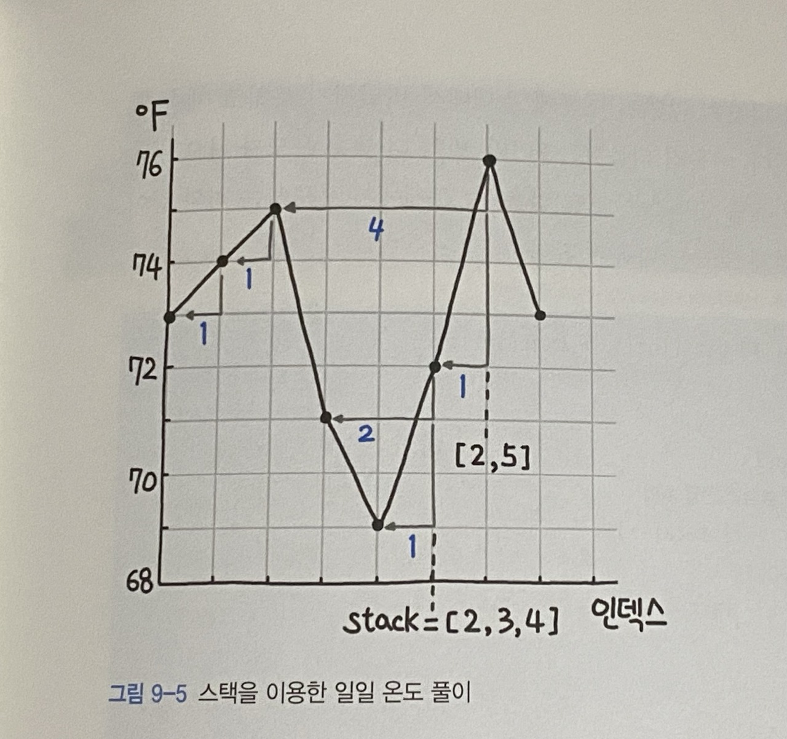

풀이 1. 스택

```py
class Solution:
    def dailyTemperatures(self, temperatures: List[int]) -> List[int]:
        stack = []
        answer = [0] * len(temperatures)

        for i, cur in enumerate(temperatures):
            while stack and cur > temperatures[stack[-1]]:
                popped = stack.pop()
                answer[popped] = i - popped
            stack.append(i)

        return answer
```

이 문제는 풀이의 그림을 참고했다.



answer 는 배열이고 이 배열에 더 따뜻한 날씨를 위해서 며칠을 기다리는지가 삽입된다. <br />
모든 원소는 0으로 초기화되고 다음 더 따뜻한 날이 없다면 추가할 필요가 없으므로 answer의 해당 온도의 날은 0을 유지한다. <br />
스택에 온도의 인덱스를 삽입하고 <br />
현재 loop의 온도와 스택에 마지막에 삽입된 인덱스를 T에서 검색한 온도를 비교하는데 <br />
만약 현재 loop의 온도가 더 크다면 스택에서 해당 인덱스를 pop하고 <br />
현재 loop 인덱스에서 pop한 인덱스를 빼준다. (current loop index - popped index) <br />
그리고 answer 배열에 pop한 인덱스에 그 빼준 값을 할당해준다. <br />

T = [73,74,75,71,69,72,76,73] 일 때 (T = temperatures)

1. stack.append(0) #가장 처음에는 73번째 인덱스 0을 stack에 삽입한다.
2. 74 - 73 = 1, answer[0] = 1, stack.append(1) #현재 온도 - pop한 인덱스의 온도를 pop한 인덱스에 할당해준다. 그리고 74번째 인덱스 1을 스택에 삽입한다.
3. 75 - 74 = 1, answer[1] = 1, stack.append(2)
4. stack.append(3) #current loop index가 더 크지 않으니 해당 인덱스를 stack에 삽입만 해준다.
5. stack.append(4)
6. 현재 stack = [2, 3, 4] #더 큰 온도가 나오지 않았으므로 계속 스택에 남아있었던 인덱스들이다.
   여기서 온도는 72가 되고 스택에서 꺼낸 5번째 온도인 69가 더 작으므로
   current loop index(5) - popped index(4) = 1, 결과 1을 answer의 popped index에 저장해준다.
   그러면 stack = [2, 3]이 되는데 스택에 인덱스가 존재하니까 계속 while문으로 현재 온도와 비교를 해줘야한다.
   71은 72보다 작으므로 5 - 3 = 2를 answer[3]에 할당해준다.
   마지막으로 75는 72보다 더 크므로 계속 스택에 남아있고 다음 loop로 넘어간다.
   stack.append(5)
7. 현재 stack = [2, 5]
   72는 76보다 작으므로 6 - 5 = 1을 answer[5]에 할당해준다.
   stack에 2가 있으니 while을 반복하면 75는 76보다 작으므로 6 - 2 = 4를 answer[2]에 저장해준다.
   stack.append(6)
8. 76은 73보다 더 크므로 계속 스택에 남아있는다.
   stack.append(7)

<br />

answer = [1, 1, 4, 2, 1, 1, 0, 0]이 답이 된다. <br />
T의 마지막 loop인 76은 73보다 더 커서 스택에 계속 남아있고 73은 그 다음 비교할 대상이 없으므로 무조건 기본값 0을 유지하고, [6, 7]이 스택에 남아있는 상태에서 answer를 리턴하게 된다.
