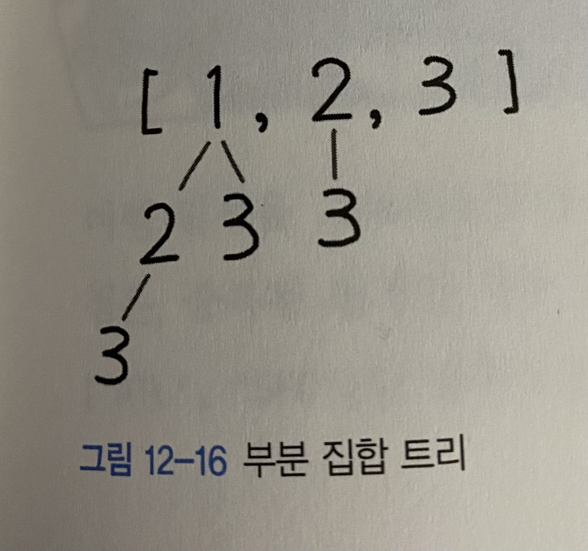

풀이 1. 트리의 모든 DFS 결과

```py
class Solution:
    def subsets(self, nums: List[int]) -> List[List[int]]:
        answer: List[List[int]] = []

        def dfs(index, path):
            answer.append(path)

            for i in range(index, len(nums)):
                dfs(i + 1, path + [nums[i]])

        dfs(0, [])

        return answer
```

입력값이 [1, 2, 3]일 때 다음 그림과 같이 트리 구성을 해서 답을 구할 수 있다.



path를 만들어나가면서 index를 1씩 증가하면서 깊이 탐색을 한다. <br />
부분집합은 특별히 종료 조건이 없다. <br />
부분 집합은 모든 탐색의 경로가 결국 정답이 되므로, <br />
탐색할 때마다 매번 결과를 추가하면 된다. <br />
