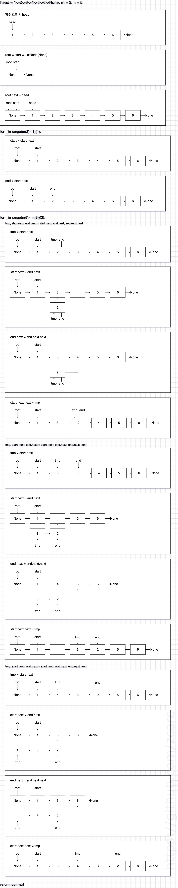

풀이 1. 반복 구조로 노드 뒤집기

```py
# Definition for singly-linked list.
# class ListNode:
#     def __init__(self, val=0, next=None):
#         self.val = val
#         self.next = next

class Solution:
    def reverseBetween(self, head: Optional[ListNode], left: int, right: int) -> Optional[ListNode]:
        # 예외 처리
        if not head or left == right:
            return head

        root = start = ListNode(None)
        start.next = head

        # start 지정
        for _ in range(left - 1):
            start = start.next

        # end 지정
        end = start.next


        # 반복하면서 노드 차례대로 뒤집기
        for _ in range(right - left):
            tmp, start.next, end.next = start.next, end.next, end.next.next
            start.next.next = tmp

        return root.next
```

그림으로 설명해본다.



Input = 1->2->3->4->5->None, m = 2, n = 3 <br />
이렇게 주어지면 노드 2하고 노드 3이 바뀌어야하므로 <br />
결과는 1->3->2->4->5->None이 되어야 한다. <br />

 <br />

첫번째 for문은 한번 실행되므로 start, end의 할당은 다음과 같이 된다. <br />
start(1->2->3->4->5->None), end(2->3->4->5->None) <br />

 <br />

두번 째 for문에서 다음과 같이 만든다. <br />
start(1->3->4->5->None), end(2->4->5->None), tmp(start.next가 가리키는 노드) <br />
이렇게 까지 만들었으면 <br />
start.next(3->4->5->None) 노드의 다음 노드에 tmp를 할당하면 전체 노드의 구조는 2, 3이 뒤집어진 상태가 된다. <br />

 <br />

start 노드는 그대로 있고 그 뒤의 노드 끼리 계속 바뀐다 <br />
값을 바꾸는것이 아니고 가리키는 노드만 바뀌기 때문에 사실 값이 바뀌는 것이 아닌 가리키는 주소만 바뀐다고 할 수 있다. <br />
tmp를 할당하는 시점인 tmp = start.next 이후에 tmp 연결 리스트는 start.next = end.next를 할 때 root 연결 리스트하고 분리가 되는데 분리가 되면 tmp의 마지막 노드인 end의 다음 노드를 end.next.next를 가리키게 해야한다. (start와 end는 같은 노드를 가리키고 있고 tmp 연결 리스트는 root 연결 리스트에서 연결할 것이고 start.next는 할당되었으니 바뀌지 않을 것이기 때문에 tmp 연결 리스트의 end의 다음 노드는 end.next.next를 해서 start.next와 같은 노드를 가리키는게 아닌 end.next의 다음 노드를 end.next가 가리키게 해야한다.) 마지막에 이 분리된 tmp 연결 리스트를 start.next.next = tmp 이렇게 연결해주면 <br />
root 연결 리스트는 인덱스로 지정한 범위의 노드가 뒤집힌 구조가 된다. <br />
m은 실제 위치가 아닌 그 전 노드로 할당하는 이유는 가리키는 노드의 위치를 그 전 노드에서 바꿔주기 위해서이다. <br />
그리고 n의 반복횟수는 인덱스의 위치가 아닌 반복의 횟수로 노드의 위치가 바뀌기 때문에 계속 start.next가 end.next를 할당해서 root 노드의 계속 앞쪽으로 향할 것이고 <br />
end.next는 end.next.next를 할당해서 end.next가 가리키는 위치는 root 노드의 뒤쪽으로 점점 이동할 것이고 따로 분리된 tmp 연결 리스트는 마지막에 root 연결 리스트에서 연결만 해주면 끝이난다. <br />
root 연결 리스트에서 end에 할당한 노드의 위치는 모든 연산이 끝난 뒤에 파라미터으로 받은 n번째에 있다. <br />
